# 第七章 Servlet

# 第一节 Servlet概述

## 1、Servlet名字

Servlet=Server+applet

Server：服务器

applet：小程序

Servlet含义是服务器端的小程序

## 2、Servlet在整个Web应用中起到的作用

### ①生活中的例子


### ②对应Web应用


### ③具体细节


### ④Servlet扮演角色


在整个Web应用中，Servlet主要负责处理请求、协调调度功能。我们可以把Servlet称为Web应用中的<span style="color:blue;font-weight:bold;">『控制器』</span>

# 第二节 Servlet HelloWorld

## 1、HelloWorld分析

### ①目标

在页面上点击超链接，由Servlet处理这个请求，并返回一个响应字符串：Hello,I am Servlet

### ②思路


## 2、具体操作

### ①第一步：创建动态Web module

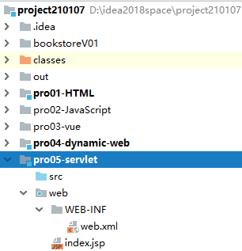

### ②第二步：创建超链接

```html
<!-- /Web应用地址/Servlet地址 -->
<a href="/app/helloServlet">Servlet Hello World</a>
```

### ③第三步：创建HelloServlet的Java类

```java
public class HelloServlet implements Servlet {
    @Override
    public void init(ServletConfig servletConfig) throws ServletException {

    }

    @Override
    public ServletConfig getServletConfig() {
        return null;
    }

    @Override
    public void service(ServletRequest servletRequest, ServletResponse servletResponse) throws ServletException, IOException {

        // 控制台打印，证明这个方法被调用了
        System.out.println("我是HelloServlet，我执行了！");

        // 返回响应字符串
        // 1、获取能够返回响应数据的字符流对象
        PrintWriter writer = servletResponse.getWriter();

        // 2、向字符流对象写入数据
        writer.write("Hello,I am Servlet");
    }

    @Override
    public String getServletInfo() {
        return null;
    }

    @Override
    public void destroy() {

    }
}
```


### ④第四步：配置HelloServlet

配置文件位置：WEB-INF/web.xml


```xml
<!-- 配置Servlet本身 -->
<servlet>
    <!-- 全类名太长，给Servlet设置一个简短名称 -->
    <servlet-name>HelloServlet</servlet-name>

    <!-- 配置Servlet的全类名 -->
    <servlet-class>com.atguigu.servlet.HelloServlet</servlet-class>
</servlet>

<!-- 将Servlet和访问地址关联起来 -->
<servlet-mapping>
    <servlet-name>HelloServlet</servlet-name>
    <url-pattern>/helloServlet</url-pattern>
</servlet-mapping>
```

<span style="color:blue;font-weight:bold;">『虚拟路径』</span>：Servlet并<span style="color:blue;font-weight:bold;">不是</span>文件系统中<span style="color:blue;font-weight:bold;">实际存在</span>的<span style="color:blue;font-weight:bold;">目录或文件</span>，所以为了方便浏览器访问，我们创建了<span style="color:blue;font-weight:bold;">虚拟</span>出来的路径来访问它。

### ⑤小结

- 需求：在浏览器上点超链接能够访问Java程序


## 3、梳理概念

### ①原生Tomcat

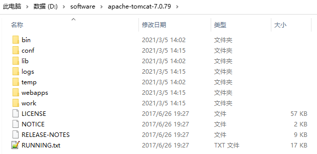

### ②IDEA中的Tomcat实例


### ③IDEA中的Web工程


### ④根据Web工程生成的war包

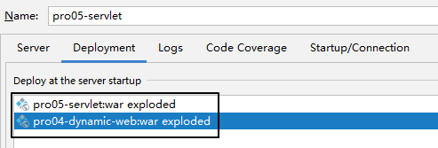

### ⑤Web工程中的资源

#### [1]静态资源

- HTML文件
- CSS文件
- JavaScript文件
- 图片文件

#### [2]动态资源

- Servlet

### ⑥访问资源的地址

#### [1]静态资源

> /Web应用名称/静态资源本身的路径

#### [2]动态资源

> /Web应用名称/虚拟路径

### ⑦Web应用名称


### ⑧总体的逻辑结构


# 第三节 Servlet 生命周期

## 1、从Servlet接口说起

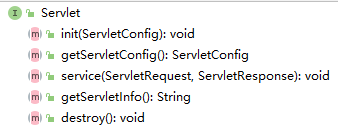

## 2、Servlet创建对象的时机

### ①验证方式

在HelloServlet的构造器中执行控制台打印

```java
public HelloServlet(){
    System.out.println("我来了！HelloServlet对象创建！");
}
```

### ②打印结果

> 我来了！HelloServlet对象创建！
> 我是HelloServlet，我执行了！
> 我是HelloServlet，我执行了！
> 我是HelloServlet，我执行了！
> 我是HelloServlet，我执行了！
> 我是HelloServlet，我执行了！
> 我是HelloServlet，我执行了！

### ③结论

- 默认情况下：Servlet在<span style="color:blue;font-weight:bold;">第一次接收到请求</span>的时候才创建对象
- 创建对象后，所有的URL地址匹配的请求都由这同一个对象来处理
- Tomcat中，每一个请求会被分配一个线程来处理，所以可以说：Servlet是<span style="color:blue;font-weight:bold;">单实例，多线程</span>方式运行的。
- 既然Servlet是多线程方式运行，所以有线程安全方面的可能性，所以不能在处理请求的方法中修改公共属性。

### ④修改Servlet创建对象的时机

修改web.xml中Servlet的配置：

```xml
<!-- 配置Servlet本身 -->
<servlet>
    <!-- 全类名太长，给Servlet设置一个简短名称 -->
    <servlet-name>HelloServlet</servlet-name>

    <!-- 配置Servlet的全类名 -->
    <servlet-class>com.atguigu.servlet.HelloServlet</servlet-class>

    <!-- 配置Servlet启动顺序 -->
    <load-on-startup>1</load-on-startup>
</servlet>
```

效果：Web应用启动的时候创建Servlet对象

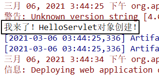

友情提示：将来配置SpringMVC的时候会看到这样的配置。

## 3、其他环节


## 4、Servlet容器

### ①容器

在开发使用的各种技术中，经常会有很多对象会放在容器中。

### ②容器提供的功能

容器会管理内部对象的整个生命周期。对象在容器中才能够正常的工作，得到来自容器的全方位的支持。

- 创建对象
- 初始化
- 工作
- 清理

### ③容器本身也是对象

- 特点1：往往是非常大的对象
- 特点2：通常的单例的

### ④典型Servlet容器产品举例

- Tomcat
- jetty
- jboss
- Weblogic
- WebSphere
- glassfish

## 5、总结

| 名称       | 时机                                                         | 次数 |
| ---------- | ------------------------------------------------------------ | ---- |
| 创建对象   | 默认情况：接收到第一次请求<br />修改启动顺序后：Web应用启动过程中 | 一次 |
| 初始化操作 | 创建对象之后                                                 | 一次 |
| 处理请求   | 接收到请求                                                   | 多次 |
| 销毁操作   | Web应用卸载之前                                              | 一次 |

> 小提示：
>
> 我们学习任何一章的知识，通常都包括两类：
>
> - 现在用得上的——优先级高
> - 以后才用的——优先级低
>
> 生命周期部分就属于以后才用的知识。

# 第四节 ServletConfig和ServletContext

## 1、类比


## 2、ServletConfig接口

### ①接口概览


### ②接口方法介绍

| 方法名                                                       | 作用                                                         |
| ------------------------------------------------------------ | ------------------------------------------------------------ |
| getServletName()                                             | 获取&lt;servlet-name&gt;HelloServlet&lt;/servlet-name&gt;定义的Servlet名称 |
| <span style="color:blue;font-weight:bold;">getServletContext()</span> | 获取ServletContext对象                                       |
| getInitParameter()                                           | 获取配置Servlet时设置的『初始化参数』，根据名字获取值        |
| getInitParameterNames()                                      | 获取所有初始化参数名组成的Enumeration对象                    |

### ③初始化参数举例

```xml
<!-- 配置Servlet本身 -->
<servlet>
    <!-- 全类名太长，给Servlet设置一个简短名称 -->
    <servlet-name>HelloServlet</servlet-name>

    <!-- 配置Servlet的全类名 -->
    <servlet-class>com.atguigu.servlet.HelloServlet</servlet-class>

    <!-- 配置初始化参数 -->
    <init-param>
        <param-name>goodMan</param-name>
        <param-value>me</param-value>
    </init-param>

    <!-- 配置Servlet启动顺序 -->
    <load-on-startup>1</load-on-startup>
</servlet>
```

### ④体验

在HelloServlet中增加代码：

```java
public class HelloServlet implements Servlet {

    // 声明一个成员变量，用来接收init()方法传入的servletConfig对象
    private ServletConfig servletConfig;

    public HelloServlet(){
        System.out.println("我来了！HelloServlet对象创建！");
    }

    @Override
    public void init(ServletConfig servletConfig) throws ServletException {

        System.out.println("HelloServlet对象初始化");

        // 将Tomcat调用init()方法时传入的servletConfig对象赋值给成员变量
        this.servletConfig = servletConfig;

    }

    @Override
    public ServletConfig getServletConfig() {

        // 返回成员变量servletConfig，方便使用
        return this.servletConfig;
    }

    @Override
    public void service(ServletRequest servletRequest, ServletResponse servletResponse) throws ServletException, IOException {

        // 控制台打印，证明这个方法被调用了
        System.out.println("我是HelloServlet，我执行了！");

        // 返回响应字符串
        // 1、获取能够返回响应数据的字符流对象
        PrintWriter writer = servletResponse.getWriter();

        // 2、向字符流对象写入数据
        writer.write("Hello,I am Servlet");

        // =============分割线===============
        // 测试ServletConfig对象的使用
        // 1.获取ServletConfig对象：在init()方法中完成
        System.out.println("servletConfig = " + servletConfig.getClass().getName());

        // 2.通过servletConfig对象获取ServletContext对象
        ServletContext servletContext = this.servletConfig.getServletContext();
        System.out.println("servletContext = " + servletContext.getClass().getName());

        // 3.通过servletConfig对象获取初始化参数
        Enumeration<String> enumeration = this.servletConfig.getInitParameterNames();
        while (enumeration.hasMoreElements()) {
            String name = enumeration.nextElement();
            System.out.println("name = " + name);

            String value = this.servletConfig.getInitParameter(name);
            System.out.println("value = " + value);
        }
    }

    @Override
    public String getServletInfo() {
        return null;
    }

    @Override
    public void destroy() {
        System.out.println("HelloServlet对象即将销毁，现在执行清理操作");
    }
}
```

打印效果：

> 我是HelloServlet，我执行了！
> servletConfig = org.apache.catalina.core.StandardWrapperFacade
> servletContext = org.apache.catalina.core.ApplicationContextFacade
> name = goodMan
> value = me

引申：

- 广义Servlet：javax.servlet包下的一系列接口定义的一组<span style="color:blue;font-weight:bold;">Web开发标准</span>。遵循这一套标准，不同的Servlet容器提供了不同的实现。
- 狭义Servlet：javax.servlet.Servlet接口和它的实现类，也就是实际开发时使用的具体的Servlet。

Servlet标准和JDBC标准对比：

| Servlet标准                     | JDBC标准                             |
| ------------------------------- | ------------------------------------ |
| javax.servlet包下的一系列接口   | javax.sql包下的一系列接口            |
| Servlet容器厂商提供的具体实现类 | 数据库厂商提供的实现类（数据库驱动） |

同样都体现了<span style="color:blue;font-weight:bold;">面向接口编程</span>的思想，同时也体现了<span style="color:blue;font-weight:bold;">解耦</span>的思想：只要接口不变，下层方法有任何变化，都不会影响上层方法。


## 3、ServletContext接口

### ①简介

- 代表：整个Web应用
- 是否单例：是
- 典型的功能：
  - 获取某个资源的真实路径：getRealPath()
  - 获取整个Web应用级别的初始化参数：getInitParameter()
  - 作为Web应用范围的域对象
    - 存入数据：setAttribute()
    - 取出数据：getAttribute()

### ②体验

#### [1]配置Web应用级别的初始化参数

```xml
    <!-- 配置Web应用的初始化参数 -->
    <context-param>
        <param-name>handsomeMan</param-name>
        <param-value>alsoMe</param-value>
    </context-param>
```

#### [2]获取参数

```java
String handsomeMan = servletContext.getInitParameter("handsomeMan");
System.out.println("handsomeMan = " + handsomeMan);
```

# 第五节 使用IDEA创建Servlet


```xml
<!-- IDEA会自动生成servlet标签 -->
<servlet>
    <servlet-name>QuickServlet</servlet-name>
    <servlet-class>com.atguigu.servlet.QuickServlet</servlet-class>
</servlet>

<!-- 我们自己补充servlet-mapping标签 -->
<servlet-mapping>
    <servlet-name>QuickServlet</servlet-name>
    <url-pattern>/QuickServlet</url-pattern>
</servlet-mapping>
```

IDEA生成的Servlet自动继承了HttpServlet

```java
public class QuickServlet extends HttpServlet {
    protected void doPost(HttpServletRequest request, HttpServletResponse response) throws ServletException, IOException {

    }

    protected void doGet(HttpServletRequest request, HttpServletResponse response) throws ServletException, IOException {

    }
}
```

下面是测试代码：

```java
public class QuickServlet extends HttpServlet {
    protected void doPost(HttpServletRequest request, HttpServletResponse response) throws ServletException, IOException {
        response.getWriter().write("doPost method processed");
    }

    protected void doGet(HttpServletRequest request, HttpServletResponse response) throws ServletException, IOException {
        response.getWriter().write("doGet method processed");
    }
}
```

```html
<form action="/app/QuickServlet" method="get">
    <button type="submit">发送GET请求</button>
</form>

<br/>

<form action="/app/QuickServlet" method="post">
    <button type="submit">发送POST请求</button>
</form>
```

# 第六节 继承关系

## 1、提出问题

- 为什么IDEA创建Servlet之后不再<span style="color:blue;font-weight:bold;">实现Servlet接口</span>而是<span style="color:blue;font-weight:bold;">继承HttpServlet类</span>？
- <span style="color:blue;font-weight:bold;">Servlet接口</span>和<span style="color:blue;font-weight:bold;">HttpServlet类</span>有什么关系？
- <span style="color:blue;font-weight:bold;">doXxx()方法</span>和<span style="color:blue;font-weight:bold;">service()方法</span>有什么关系？

## 2、类型关系


## 3、方法关系

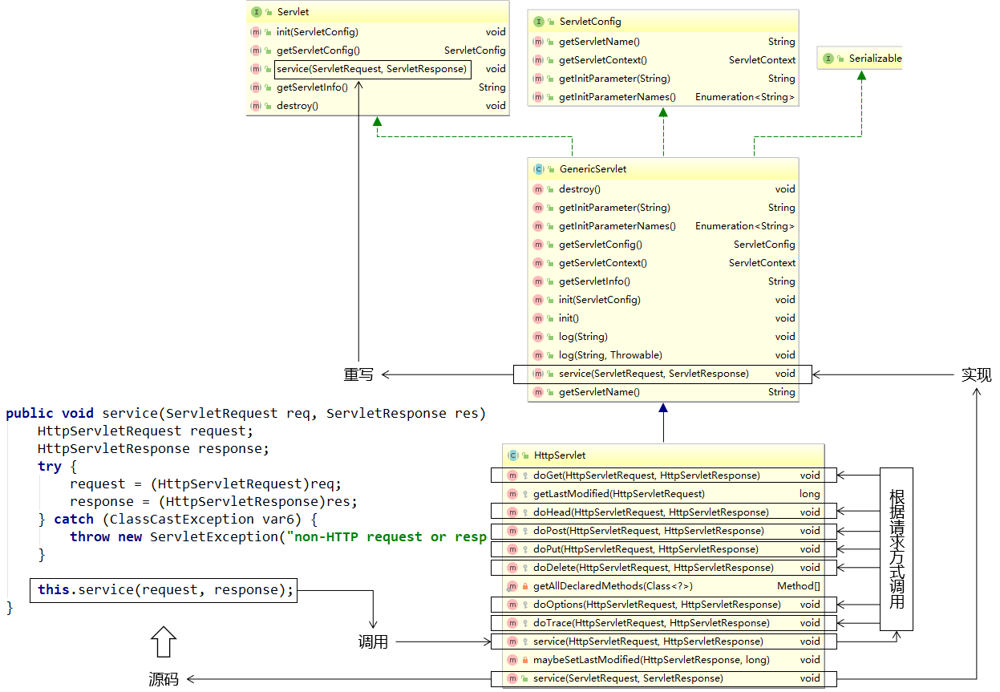


# 第七节 动态Web工程内编写路径

## 1、为什么要写路径？


- 整个系统要根据功能拆分成许许多多<span style="color:blue;font-weight:bold;">独立</span>的<span style="color:blue;font-weight:bold;">资源</span>
- 资源之间既要完成自身的功能又要和其他资源<span style="color:blue;font-weight:bold;">配合</span>
- 写路径就是为了从一个资源<span style="color:blue;font-weight:bold;">跳转</span>到下一个资源

## 2、为什么写路径这事有点复杂？

### ①先开发再部署

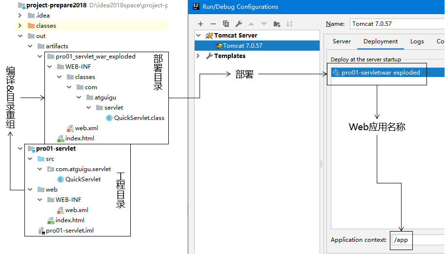

- <span style="color:blue;font-weight:bold;">工程目录</span>：我们写代码的地方，但是在服务器上运行的不是这个。
- <span style="color:blue;font-weight:bold;">部署目录</span>：经过Java源文件<span style="color:blue;font-weight:bold;">编译</span>和<span style="color:blue;font-weight:bold;">目录重组</span>后，IDEA就替我们准备好了可以在服务器上运行的部署目录。
- <span style="color:blue;font-weight:bold;">区别</span>：因为从工程目录到部署目录经过了<span style="color:blue;font-weight:bold;">目录重组</span>，所以它们的目录结构是<span style="color:blue;font-weight:bold;">不同</span>的。
- <span style="color:blue;font-weight:bold;">基准</span>：用户通过浏览器访问服务器，而服务器上运行的是部署目录，所以写路径的时候<span style="color:blue;font-weight:bold;">参考部署目录</span>而不是工程目录。
- <span style="color:blue;font-weight:bold;">对应关系</span>：<span style="color:blue;font-weight:bold;">工程目录下的web目录对应部署目录的根目录</span>，同时部署目录的根目录也是路径中的<span style="color:blue;font-weight:bold;">Web应用根目录</span>。


### ②路径的各个组成部分

从最前面一直到Web应用名称这里都是固定写法，到资源名这里要看具体是什么资源。


#### [1]具体文件

我们写代码的时候都是在工程目录下操作，所以参照工程目录来说最方便。按照工程目录的目录结构来说，从web目录开始按照实际目录结构写就好了（不包括web目录本身）。

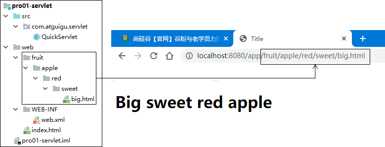

#### [2]Servlet

访问Servlet的路径是我们在web.xml中配置的，大家可能注意到了，url-pattern里面的路径我们也是<span style="color:blue;font-weight:bold;">斜杠开头</span>的，但是这个开头的斜杠代表<span style="color:blue;font-weight:bold;">Web应用根目录</span>。


同样是开头的斜杠，超链接路径中的开头斜杠代表服务器根目录，Servlet地址开头的斜杠，代表Web应用根目录，怎么记呢？请看下面的准则：

## 3、准则

> 用通俗的大白话来解释：一个路径由谁来解析，其实就是这个路径是谁来用。

| 路径类型           | 解析方式                  |
| ------------------ | ------------------------- |
| 由浏览器解析的路径 | 开头斜杠代表服务器根目录  |
| 由服务器解析的路径 | 开头斜杠代表Web应用根目录 |


那么具体来说，哪些路径是浏览器解析的，哪些路径是服务器解析的呢？

- 浏览器解析的路径举例：
  - 所有HTML标签中的路径
  - 重定向过程中指定的路径
- 服务器解析的路径举例：
  - 所有web.xml中配置的路径
  - 请求转发过程中指定的路径

## 4、写路径的步骤

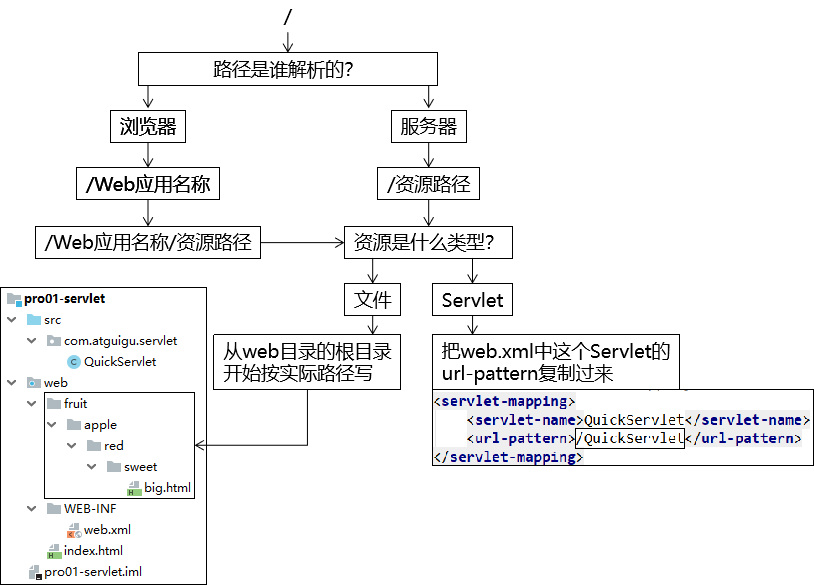

## 5、动态获取上下文路径

### ①上下文路径的概念

上下文路径（context path）=/Web应用名称

### ②动态获取

由于项目部署的时候，上下文路径是可以变化的，所以写死有可能发生错误。此时我们通过request对象动态获取上下文路径就不用担心这个问题了。调用下面这个方法，每一次获取的都是当前环境下实际的上下文路径的值。

```java
request.getContextPath()
```

> 如果本节让你感觉很复杂，建议你放慢节奏，尝试下面的步骤：
>
> - 第一步：先弄清楚每个『名词概念』，清楚的知道我们提到的每一个名词指的是什么。
> - 第二步：弄清楚底层运行原理，其实就是工程目录和部署目录的区别。
> - 第三步：按照我们介绍的步骤一步一步慢慢写，写一步想一想，弄清楚各个部分的对应关系。


# 第八节 请求转发和重定向

## 1、接力

发一个请求给Servlet，接力棒就传递到了Servlet手中。而绝大部分情况下，Servlet不能独自完成一切，需要把接力棒继续传递下去，此时我们就需要请求的<span style="color:blue;font-weight:bold;">『转发』</span>或<span style="color:blue;font-weight:bold;">『重定向』</span>。

## 2、转发

本质：<span style="color:blue;font-weight:bold;">转交</span>

完整定义：在请求的处理过程中，Servlet完成了自己的任务，需要把请求<span style="color:blue;font-weight:bold;">转交给下一个资源</span>继续处理。

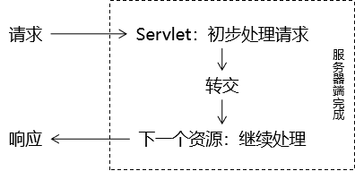

代码：

```java
request.getRequestDispatcher("/fruit/apple/red/sweet/big.html").forward(request, response);
```

类比：

| 代码                             | 类比           |
| -------------------------------- | -------------- |
| request                          | 小货车         |
| getRequestDispatcher("转发地址") | 告诉司机要去哪 |
| forward(request, response)       | 出发           |

关键：由于转发操作的核心部分是<span style="color:blue;font-weight:bold;">在服务器端完成</span>的，所以浏览器感知不到，整个过程中浏览器<span style="color:blue;font-weight:bold;">只发送一次请求</span>。


## 3、重定向

本质：<span style="color:blue;font-weight:bold;">一种特殊的响应</span>

完整定义：在请求的处理过程中，Servlet完成了自己的任务，然后以一个<span style="color:blue;font-weight:bold;">响应</span>的方式告诉浏览器：“要完成这个任务还需要你另外<span style="color:blue;font-weight:bold;">再访问下一个资源</span>”。

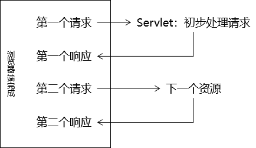

代码：

```java
response.sendRedirect("/app/fruit/apple/red/sweet/big.html");
```

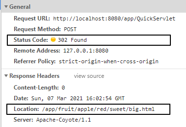

关键：由于重定向操作的核心部分是<span style="color:blue;font-weight:bold;">在浏览器端完成</span>的，所以整个过程中浏览器<span style="color:blue;font-weight:bold;">共发送两次请求</span>。

## 4、对比

| 转发                                                       | 重定向                                                     |
| ---------------------------------------------------------- | ---------------------------------------------------------- |
| <span style="color:blue;font-weight:bold;">一次请求</span> | <span style="color:blue;font-weight:bold;">两次请求</span> |
| 浏览器地址栏显示的是第一个资源的地址                       | 浏览器地址栏显示的是第二个资源的地址                       |
| 全程使用的是同一个request对象                              | 全程使用的是不同的request对象                              |
| 在服务器端完成                                             | 在浏览器端完成                                             |
| 目标资源地址由服务器解析                                   | 目标资源地址由浏览器解析                                   |
| 目标资源可以在WEB-INF目录下                                | 目标资源不能在WEB-INF目录下                                |
| 目标资源仅限于本应用内部                                   | 目标资源可以是外部资源                                     |

## 5、转发和重定向的应用场景

可以简单的判断：能用转发的先用转发，如果转发不行，再使用重定向。

- 需要通过同一个request对象把数据携带到目标资源：只能用转发
- 如果希望前往下一个资源之后，浏览器刷新访问的是第二个资源：只能用重定向


# 第九节 获取请求参数

## 1、请求参数的概念

浏览器在给服务器发送请求的同时，携带的参数数据。

## 2、浏览器端发送请求参数的基本形式

- URL地址后面附着的请求参数

> /orange/CharacterServlet?username=汤姆

- 表单
- Ajax请求（将来会学到）

## 3、服务器端对请求参数的封装

总体上来说，服务器端将请求参数封装为<span style="color:blue;font-weight:bold;">Map&lt;String, String[]&gt;</span>。

- 键：请求参数的名字
- 值：请求参数的值组成的数组

## 4、获取请求参数的方法

| 方法名                                       | 返回值类型                  |
| -------------------------------------------- | --------------------------- |
| request.getParameterMap()                    | Map&lt;String, String[]&gt; |
| request.getParameter("请求参数的名字")       | String                      |
| request.getParameterValues("请求参数的名字") | String []                   |
| request.getParameterNames()                  | Enumeration&lt;String&gt;   |

## 5、测试

### ①HTML代码

```html
<!-- 测试请求参数的表单 -->
<form action="/orange/ParamServlet" method="post">

    <!-- 单行文本框 -->
    <!-- input标签配合type="text"属性生成单行文本框 -->
    <!-- name属性定义的是请求参数的名字 -->
    <!-- 如果设置了value属性，那么这个值就是单行文本框的默认值 -->
    个性签名：<input type="text" name="signal" value="单行文本框的默认值" /><br/>

    <!-- 密码框 -->
    <!-- input标签配合type="password"属性生成密码框 -->
    <!-- 用户在密码框中填写的内容不会被一明文形式显示 -->
    密码：<input type="password" name="secret" /><br/>

    <!-- 单选框 -->
    <!-- input标签配合type="radio"属性生成单选框 -->
    <!-- name属性一致的radio会被浏览器识别为同一组单选框，同一组内只能选择一个 -->
    <!-- 提交表单后，真正发送给服务器的是name属性和value属性的值 -->
    <!-- 使用checked="checked"属性设置默认被选中 -->
    请选择你最喜欢的季节：
    <input type="radio" name="season" value="spring" />春天
    <input type="radio" name="season" value="summer" checked="checked" />夏天
    <input type="radio" name="season" value="autumn" />秋天
    <input type="radio" name="season" value="winter" />冬天

    <br/><br/>

    你最喜欢的动物是：
    <input type="radio" name="animal" value="tiger" />路虎
    <input type="radio" name="animal" value="horse" checked="checked" />宝马
    <input type="radio" name="animal" value="cheetah" />捷豹

    <br/>

    <!-- 多选框 -->
    <!-- input标签和type="checkbox"配合生成多选框 -->
    <!-- 多选框被用户选择多个并提交表单后会产生『一个名字携带多个值』的情况 -->
    你最喜欢的球队是：
    <input type="checkbox" name="team" value="Brazil"/>巴西
    <input type="checkbox" name="team" value="German" checked="checked"/>德国
    <input type="checkbox" name="team" value="France"/>法国
    <input type="checkbox" name="team" value="China" checked="checked"/>中国
    <input type="checkbox" name="team" value="Italian"/>意大利

    <br/>

    <!-- 下拉列表 -->
    <!-- 使用select标签定义下拉列表整体，在select标签内设置name属性 -->
    你最喜欢的运动是：
    <select name="sport">
        <!-- 使用option属性定义下拉列表的列表项 -->
        <!-- 使用option标签的value属性设置提交给服务器的值，在option标签的标签体中设置给用户看的值 -->
        <option value="swimming">游泳</option>
        <option value="running">跑步</option>

        <!-- 使用option标签的selected="selected"属性设置这个列表项默认被选中 -->
        <option value="shooting" selected="selected">射击</option>
        <option value="skating">溜冰</option>
    </select>

    <br/>

    <br/><br/>

    <!-- 表单隐藏域 -->
    <!-- input标签和type="hidden"配合生成表单隐藏域 -->
    <!-- 表单隐藏域在页面上不会有任何显示，用来保存要提交到服务器但是又不想让用户看到的数据 -->
    <input type="hidden" name="userId" value="234654745" />

    <!-- 多行文本框 -->
    自我介绍：<textarea name="desc">多行文本框的默认值</textarea>

    <br/>

    <!-- 普通按钮 -->
    <button type="button">普通按钮</button>

    <!-- 重置按钮 -->
    <button type="reset">重置按钮</button>

    <!-- 表单提交按钮 -->
    <button type="submit">提交按钮</button>
</form>
```

### ②Java代码

```java
protected void doPost(HttpServletRequest request, HttpServletResponse response) throws ServletException, IOException {

    // 获取包含全部请求参数的Map
    Map<String, String[]> parameterMap = request.getParameterMap();

    // 遍历这个包含全部请求参数的Map
    Set<String> keySet = parameterMap.keySet();

    for (String key : keySet) {

        String[] values = parameterMap.get(key);

        System.out.println(key + "=" + Arrays.asList(values));
    }

    System.out.println("---------------------------");

    // 根据请求参数名称获取指定的请求参数值
    // getParameter()方法：获取单选框的请求参数
    String season = request.getParameter("season");
    System.out.println("season = " + season);

    // getParameter()方法：获取多选框的请求参数
    // 只能获取到多个值中的第一个
    String team = request.getParameter("team");
    System.out.println("team = " + team);

    // getParameterValues()方法：取单选框的请求参数
    String[] seasons = request.getParameterValues("season");
    System.out.println("Arrays.asList(seasons) = " + Arrays.asList(seasons));

    // getParameterValues()方法：取多选框的请求参数
    String[] teams = request.getParameterValues("team");
    System.out.println("Arrays.asList(teams) = " + Arrays.asList(teams));

}
```

# 第十节 请求响应设置字符集

## 1、请求

### ①GET请求

#### [1]设置之前

发送请求参数：

```html
<a href="/orange/CharacterServlet?username=汤姆">测试请求字符集设置：GET请求</a>
```

接收到的数据：

> username = ?±¤?§?

#### [2]设置方式


在server.xml第71行的Connector标签中增加URIEncoding属性：

```xml
<Connector port="8080" protocol="HTTP/1.1"
		   connectionTimeout="20000"
		   redirectPort="8443" 
		   URIEncoding="UTF-8"
		   />
```

重启Tomcat实例即可。再重新测试的结果是：

> username = 汤姆

### ②POST请求

#### [1]设置之前

发送请求参数：

```html
<!-- 测试请求字符集设置：POST请求 -->
<form action="/orange/CharacterServlet" method="post">

    用户名：<input type="text" name="username" /><br/>

    <button type="submit">保存</button>

</form>
```

接收到的数据：

> username = ?????????

#### [2]设置方式

```java
// 使用request对象设置字符集
request.setCharacterEncoding("UTF-8");

// 获取请求参数
String username = request.getParameter("username");

System.out.println("username = " + username);
```

接收到的数据：

> username = 林志玲

#### [3]需要注意的问题

不能在设置字符集之前获取请求参数！下面是错误的<span style="color:blue;font-weight:bold;">示范</span>：

```java
// 获取请求参数（先获取请求参数会导致设置字符集失效）
String username = request.getParameter("username");

// 使用request对象设置字符集
request.setCharacterEncoding("UTF-8");

System.out.println("username = " + username);
```


## 2、响应

### ①设置之前

服务器端代码：

```java
PrintWriter writer = response.getWriter();

writer.write("志玲姐姐你好！");
```

浏览器显示：

> ???????

### ②设置方式一

编码字符集和解码字符集一致

```java
// 设置服务器端的编码字符集
response.setCharacterEncoding("UTF-8");

PrintWriter writer = response.getWriter();

writer.write("<!DOCTYPE html>                  ");
writer.write("<html>                           ");
writer.write("<head>                           ");
writer.write("<!-- 设置浏览器端的解码字符集 -->");
writer.write("    <meta charset='UTF-8'>       ");
writer.write("    <title>Title</title>         ");
writer.write("</head>                          ");
writer.write("<body>                           ");
writer.write("<p>志玲姐姐你好！</p>            ");
writer.write("</body>                          ");
writer.write("</html>                          ");
```

### ③设置方式二

```java
response.setContentType("text/html;charset=UTF-8");
```

### ④需要注意的问题

response.getWriter()不能出现在设置字符集操作的前面（两种方式都不行）。