# 1、配置文件

## 1、配置

### ①设置

所谓设置其实就是通过修改一个一个的<span style="color:blue;font-weight:bold;">参数</span>，告诉<span style="color:blue;font-weight:bold;">应用软件</span>它该<span style="color:blue;font-weight:bold;">怎么工作</span>。

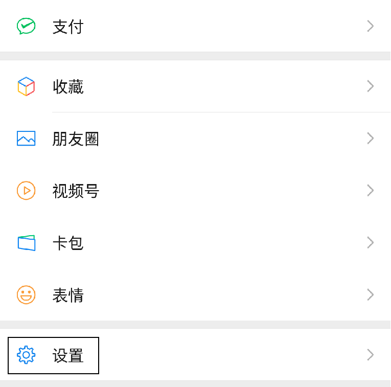

### ②配置

本质上配置和设置是一样的，只是对象和形式不同：

| &nbsp; | 配置                       | 设置               |
| ------ | -------------------------- | ------------------ |
| 对象   | 开发中使用的应用程序或框架 | 应用软件           |
| 形式   | 特定格式的配置文件         | 应用软件的友好界面 |

## 2、配置文件

### ①XML

先来个例子：

```xml
<?xml version="1.0" encoding="UTF-8"?>
<web-app xmlns="http://xmlns.jcp.org/xml/ns/javaee"
         xmlns:xsi="http://www.w3.org/2001/XMLSchema-instance"
         xsi:schemaLocation="http://xmlns.jcp.org/xml/ns/javaee http://xmlns.jcp.org/xml/ns/javaee/web-app_4_0.xsd"
         version="4.0">

    <!-- 配置SpringMVC前端控制器 -->
    <servlet>
        <servlet-name>dispatcherServlet</servlet-name>
        <servlet-class>org.springframework.web.servlet.DispatcherServlet</servlet-class>

        <!-- 在初始化参数中指定SpringMVC配置文件位置 -->
        <init-param>
            <param-name>contextConfigLocation</param-name>
            <param-value>classpath:spring-mvc.xml</param-value>
        </init-param>

        <!-- 设置当前Servlet创建对象的时机是在Web应用启动时 -->
        <load-on-startup>1</load-on-startup>

    </servlet>
    <servlet-mapping>
        <servlet-name>dispatcherServlet</servlet-name>

        <!-- url-pattern配置斜杠表示匹配所有请求 -->
        <!-- 两种可选的配置方式：
                1、斜杠开头：/
                2、包含星号：*.atguigu
             不允许的配置方式：前面有斜杠，中间有星号
                /*.app
         -->
        <url-pattern>/</url-pattern>
    </servlet-mapping>
</web-app>
```

#### [1]名词解释

XML是e<span style="color:blue;font-weight:bold;">X</span>tensible <span style="color:blue;font-weight:bold;">M</span>arkup <span style="color:blue;font-weight:bold;">L</span>anguage的缩写，翻译过来就是<span style="color:blue;font-weight:bold;">可扩展标记语言</span>。所以很明显，XML和HTML一样都是标记语言，也就是说它们的基本语法都是标签。

#### [2]可扩展

<span style="color:blue;font-weight:bold;">可扩展</span>三个字<span style="color:blue;font-weight:bold;">表面上</span>的意思是XML允许<span style="color:blue;font-weight:bold;">自定义格式</span>。但是别美，这<span style="color:blue;font-weight:bold;">不代表</span>你<span style="color:blue;font-weight:bold;">可以随便写</span>。


在XML基本语法规范的基础上，你使用的那些第三方应用程序、框架会通过设计<span style="color:blue;font-weight:bold;">『XML约束』</span>的方式<span style="color:blue;font-weight:bold;">『强制规定』</span>配置文件中可以写什么和怎么写，规定之外的都不可以写。

XML基本语法这个知识点的定位是：我们不需要从零开始，从头到尾的一行一行编写XML文档，而是在第三方应用程序、框架<span style="color:blue;font-weight:bold;">已提供的配置文件</span>的基础上<span style="color:blue;font-weight:bold;">修改</span>。要改成什么样取决于你的需求，而怎么改取决于<span style="color:blue;font-weight:bold;">XML基本语法</span>和<span style="color:blue;font-weight:bold;">具体的XML约束</span>。

#### [3]XML基本语法

- XML声明

这部分基本上就是固定格式，大家知道就好

```xml
<?xml version="1.0" encoding="UTF-8"?>
```

- 根标签

根标签有且只能有一个。

- 标签关闭
  - 双标签：开始标签和结束标签必须成对出现。
  - 单标签：单标签在标签内关闭。
- 标签嵌套
  - 可以嵌套，但是不能交叉嵌套。
- 注释不能嵌套
- 标签名、属性名建议使用小写字母
- 属性
  - 属性必须有值
  - 属性值必须加引号，单双都行

看到这里大家一定会发现XML的基本语法和HTML的基本语法简直如出一辙。其实这不是偶然的，XML基本语法+HTML约束=HTML语法。在逻辑上HTML确实是XML的子集。

```html
<!DOCTYPE HTML PUBLIC "-//W3C//DTD HTML 4.01 Transitional//EN"
"http://www.w3.org/TR/html4/loose.dtd">
```

从HTML4.01版本的文档类型声明中可以看出，这里使用的DTD类型的XML约束。也就是说http://www.w3.org/TR/html4/loose.dtd这个文件定义了HTML文档中可以写哪些标签，标签内可以写哪些属性，某个标签可以有什么样的子标签。

#### [4]XML约束

将来我们主要就是根据XML约束中的规定来编写XML配置文件。而XML约束主要包括DTD和Schema两种。如果XML配置文件使用的是DTD，那么对我们几乎没有影响。如果是Schema约束，需要我们稍微参与一点点。

- DTD

将来在IDEA中有代码提示的协助，在DTD文档的约束下进行配置非常简单。

```dtd
<!ENTITY % fontstyle
 "TT | I | B | U | S | STRIKE | BIG | SMALL">

<!ENTITY % phrase "EM | STRONG | DFN | CODE |
                   SAMP | KBD | VAR | CITE | ABBR | ACRONYM" >

<!ENTITY % special
   "A | IMG | APPLET | OBJECT | FONT | BASEFONT | BR | SCRIPT |
    MAP | Q | SUB | SUP | SPAN | BDO | IFRAME">

<!ENTITY % formctrl "INPUT | SELECT | TEXTAREA | LABEL | BUTTON">

<!-- %inline; covers inline or "text-level" elements -->
<!ENTITY % inline "#PCDATA | %fontstyle; | %phrase; | %special; | %formctrl;">

<!ELEMENT (%fontstyle;|%phrase;) - - (%inline;)*>
<!ATTLIST (%fontstyle;|%phrase;)
  %attrs;                              -- %coreattrs, %i18n, %events --
  >
```

- Schema

我们将来使用SSM框架中的Spring、SpringMVC框架时，会涉及到一点点对Schema约束的设置。不过不必紧张，有IDEA的支持操作会非常简单，我们现在只需要理解基本概念即可。

首先我们要理解一个概念：<span style="color:blue;font-weight:bold;">『名称空间』</span>，英文：name space


Schema约束要求我们一个XML文档中，所有标签，所有属性都必须在约束中有明确的定义。

下面我们以web.xml的约束声明为例来做个说明：

```xml
<web-app xmlns="http://xmlns.jcp.org/xml/ns/javaee"
         xmlns:xsi="http://www.w3.org/2001/XMLSchema-instance"
         xsi:schemaLocation="http://xmlns.jcp.org/xml/ns/javaee http://xmlns.jcp.org/xml/ns/javaee/web-app_4_0.xsd"
         version="4.0">
```

| 属性名             | 作用                                                         |
| ------------------ | ------------------------------------------------------------ |
| xmlns              | 指出当前XML文档约束规则的名称空间在哪里<br />我们就是通过这个属性来引用一个具体的名称空间 |
| xmlns:xsi          | 指出xmlns这个属性是在哪个约束文档中被定义的                  |
| xsi:schemaLocation | 语法格式：在xsi名称空间下引用schemaLocation属性<br />配置含义：指定当前XML文档中所用到的约束文档本身的文件的地址 |

xmlns和xsi:schemaLocation对应关系如下图：


引入多个名称空间的例子如下：

```xml
<?xml version="1.0" encoding="UTF-8"?>
<beans xmlns="http://www.springframework.org/schema/beans"
	xmlns:xsi="http://www.w3.org/2001/XMLSchema-instance"
	xmlns:context="http://www.springframework.org/schema/context"
	xmlns:mvc="http://www.springframework.org/schema/mvc"
	xsi:schemaLocation="http://www.springframework.org/schema/mvc http://www.springframework.org/schema/mvc/spring-mvc-4.0.xsd
		http://www.springframework.org/schema/beans http://www.springframework.org/schema/beans/spring-beans.xsd
		http://www.springframework.org/schema/context http://www.springframework.org/schema/context/spring-context-4.0.xsd">

	<context:component-scan base-package="com.atguigu.crud.component"/>
	
	<bean id="viewResolver" class="org.springframework.web.servlet.view.InternalResourceViewResolver">
		<property name="prefix" value="/WEB-INF/pages/"/>
		<property name="suffix" value=".jsp"/>
	</bean>
	
	<mvc:default-servlet-handler/>
	<mvc:annotation-driven/>

</beans>
```


看到这么复杂，这么长的名称空间字符串，我们会觉得很担心，根本记不住。但是其实不需要记，在IDEA中编写配置文件时，IDEA会协助我们导入，会有提示。我们<span style="color:blue;font-weight:bold;">理解各个部分的含义能够调整</span>即可。

### ②属性文件

以properties作为扩展名的文件。

```properties
atguigu.jdbc.url=jdbc:mysql://192.168.198.100:3306/mybatis1026
atguigu.jdbc.driver=com.mysql.jdbc.Driver
atguigu.jdbc.username=root
atguigu.jdbc.password=atguigu
```

- 由键值对组成
- 键和值之间的符号是等号
- 每一行都必须顶格写，前面不能有空格之类的其他符号

也有人叫资源文件。

### ③其他形式

YAML语言的配置文件：在SpringBoot中使用。

```yaml
spring:
  profiles:
    active: fc
  datasource:
    name: mydb
    type: com.alibaba.druid.pool.DruidDataSource
    url: jdbc:mysql://192.168.41.100:3306/spring_boot?serverTimezone=UTC
    username: root
    password: atguigu
    driver-class-name: com.mysql.cj.jdbc.Driver
mybatis:
  mapper-locations: classpath*:/mybatis-mapper/*Mapper.xml
logging:
  level:
    com.atguigu.function.compute.mapper: debug
```

JSON格式的配置文件：一般是前端使用。

# 2、Tomcat的部署和启动

## 1、Tomcat扮演的角色

### ①对外：Web服务器


### ②对内：Servlet容器


## 2、部署

### ①前提

Tomcat本身是一个Java程序，所以当前系统中必须正确配置了JAVA_HOME环境变量。我们可以通过下面的命令检测：

> C:\Users\Administrator><span style="color:blue;font-weight:bold;">java -version</span>
> java version "1.8.0_141"
> Java(TM) SE Runtime Environment (build 1.8.0_141-b15)
> Java HotSpot(TM) 64-Bit Server VM (build 25.141-b15, mixed mode)
>
> C:\Users\Administrator><span style="color:blue;font-weight:bold;">echo %JAVA_HOME%</span>
> D:\software\Java
>
> C:\Users\Administrator><span style="color:blue;font-weight:bold;">echo %PATH%</span>
> D:\software\xftp\;C:\WINDOWS\system32;C:\WINDOWS;C:\WINDOWS\System32\Wbem;C:\WINDOWS\System32\WindowsPowerShell\v1.0\;D:\software\Java\bin;D:\software\apache-maven-3.5.4\bin;C:\Users\Administrator\AppData\Local\Microsoft\WindowsApps;

### ②解压

将Tomcat压缩包解压到一个<span style="color:blue;font-weight:bold;">非中文无空格</span>的目录下。


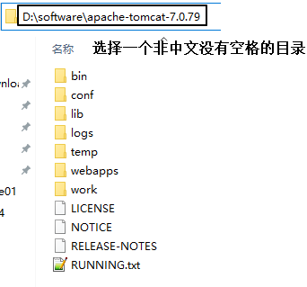

### ③Tomcat目录结构


### ④启动Tomcat并访问首页

启动Tomcat：运行Tomcat解压后根目录下\bin\startup.bat即可，例如：

> D:\software\apache-tomcat-7.0.79\bin\startup.bat


如果需要停止Tomcat，则运行shutdown.bat程序，例如：

> D:\software\apache-tomcat-7.0.79\bin\shutdown.bat

小提示：将来我们在IDEA中启动Tomcat，如果IDEA卡死强关，Tomcat不会正常退出。下次再启动Tomcat会因为残留进程仍然占用8080端口，导致新的进程无法启动。此时可以使用shutdown.bat结束残留进程。

### ⑤部署一个war包并启动Tomcat


在Tomcat启动过程中，会打印启动日志，其中我们能看到hello.war被部署的日志信息：

> 信息: Deployment of web application archive D:\software\apache-tomcat-7.0.79\webapps\hello.war has finished in 1,150 ms

此时，我们回到webapps目录，能看到hello.war被解压了：


### ⑥访问刚才部署的Web应用


### ⑦关于Tomcat端口号

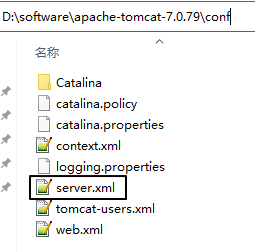

配置文件节选：

```xml
……
<!-- 第22行 -->
<Server port="8005" shutdown="SHUTDOWN">
……
<!-- 第71行 -->
<Connector port="8080" protocol="HTTP/1.1"
		   connectionTimeout="20000"
		   redirectPort="8443" />
……
<!-- 第93行 -->
<Connector port="8009" protocol="AJP/1.3" redirectPort="8443" />
```

三个位置共定义了3个端口号，Tomcat启动后，这个三个端口号都会被占用。

# 3、在IDEA中关联Tomcat


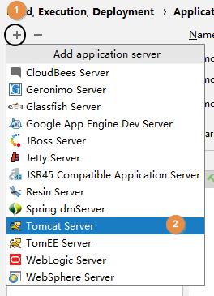

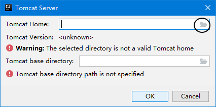

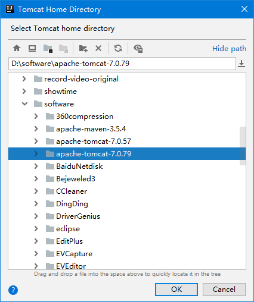

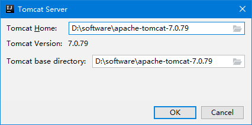


# 4、创建动态Web工程并部署运行

## 1、第一步

创建empty project

## 2、第二步

以下操作基于IDEA2018.3


创建动态Web工程：

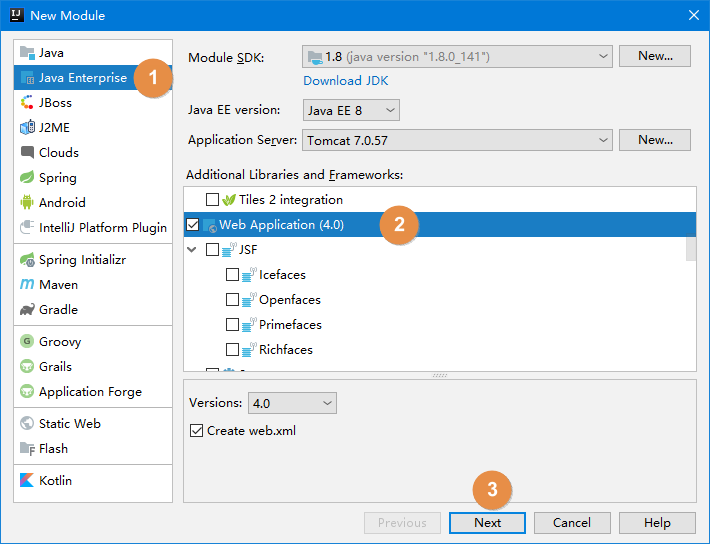

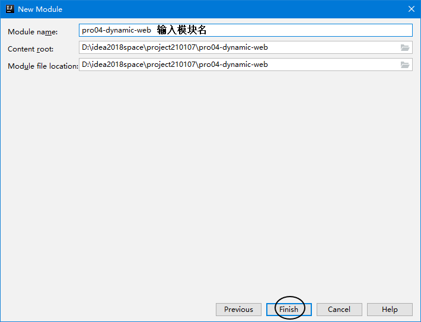

创建好的工程如下所示：


<span style="color:blue;font-weight:bold;">注意</span>：src目录应该是蓝色的，web目录的图标上有个蓝色的圆点。

## 3、动态Web工程目录结构介绍

| 目录或文件名            | 功能                                                         |
| ----------------------- | ------------------------------------------------------------ |
| src目录                 | 存放Java源文件                                               |
| web目录                 | 存放Web开发相关资源                                          |
| web/WEB-INF目录         | 存放web.xml文件、classes目录、lib目录                        |
| web/WEB-INF/web.xml文件 | 别名：部署描述符deployment descriptor<br />作用：Web工程的核心配置文件 |
| web/WEB-INF/classes目录 | 存放编译得到的*.class字节码文件                              |
| web/WEB-INF/lib目录     | 存放第三方jar包                                              |

## 4、创建用来部署Web工程的Tomcat实例


通常我们会觉得现在这个Application context太长了，改简短一些会更方便。

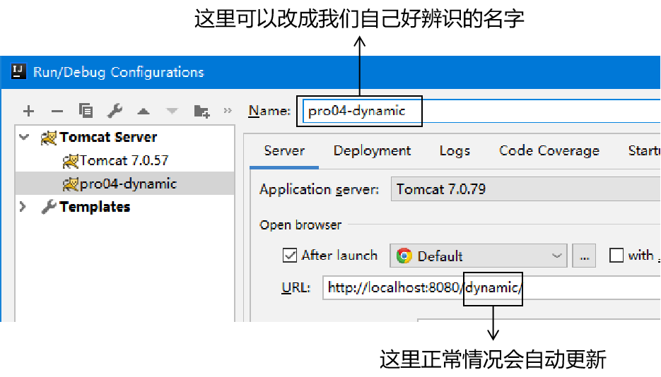

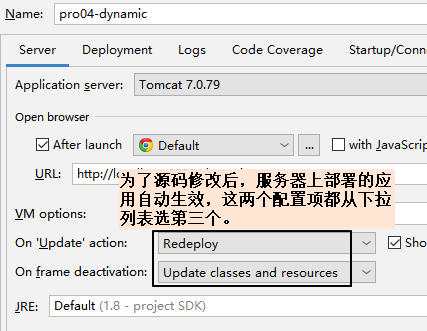

创建好的效果如下：

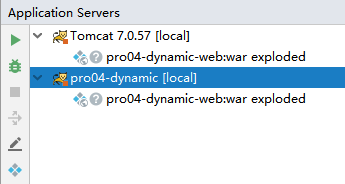

## 5、编写简单的测试代码

### ①Java代码

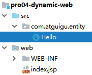

```java
public class Hello {

    public String getMessage() {
        return "年少不知软饭香";
    }

}
```


### ②JSP代码


```jsp
<%=new Hello().getMessage() %>
```

### ③启动专门为这个工程创建的Tomcat实例


### ④错误提示


提示信息的含义：未指定编译结果的保存目录。

错误原因：

- 父工程只是一个empty project
- 当前模块继承父工程的编译输出路径

为了解决这个问题我们可以在父工程中设置输出路径：

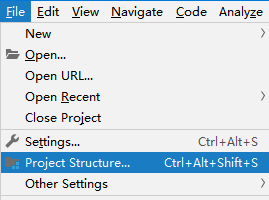


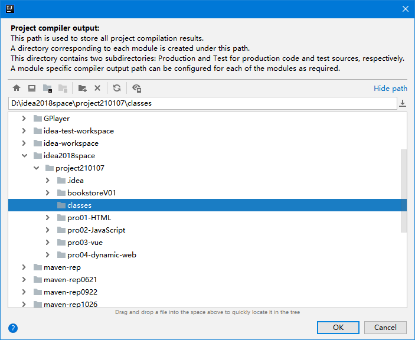

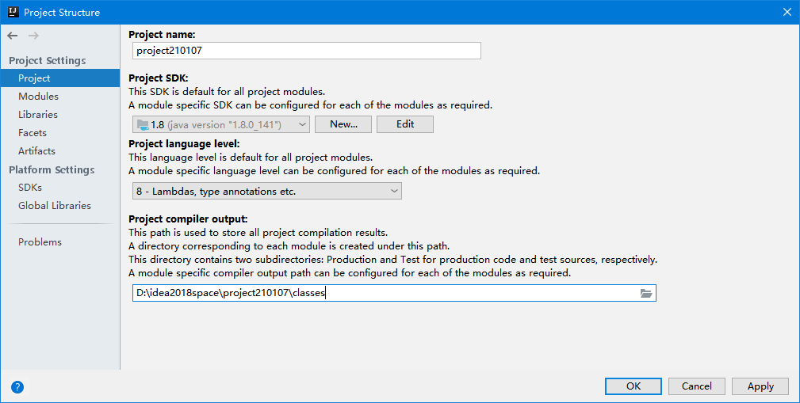

## 6、IDEA运行程序时界面布局


# 5、在IDEA中重新部署运行

## 1、为什么需要重新部署？

对于已经运行过的Web项目，如果我们增加了目录和文件，那么部署目录有可能不会自动同步过来，从而造成实际运行的效果和我们期望的不同。

如下图中，我们在工程目录已经新增了./images目录和两个图片：


但是在部署目录并没有出现：


哪怕我们执行了重新部署也没有起作用。

## 2、如何重新部署？

### ①清理部署目录

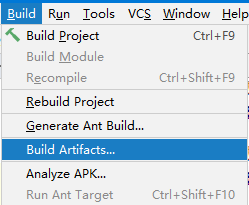


### ②构建


### ③效果

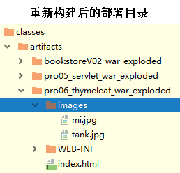


# 6、导入别人的web module

如果你想把老师发给你的module导入自己的project中运行起来，可以参考下面的操作：

> 做下面操作前，需要把要导入的module复制到project目录下。


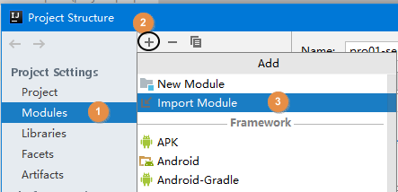

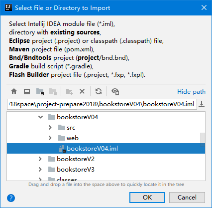


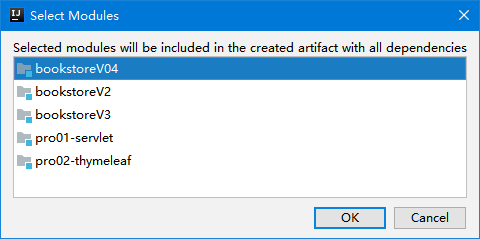


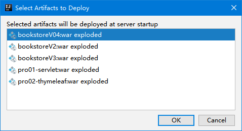

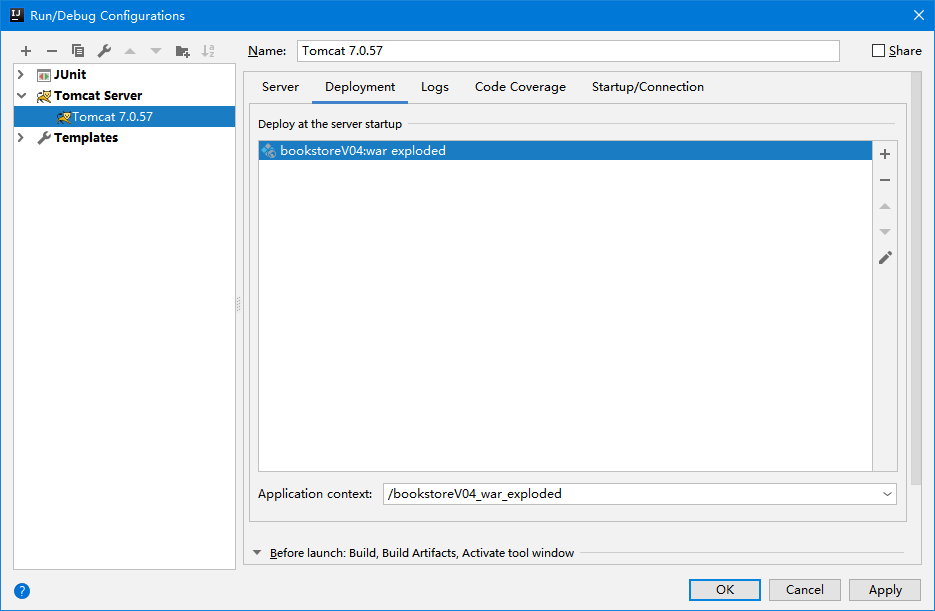
